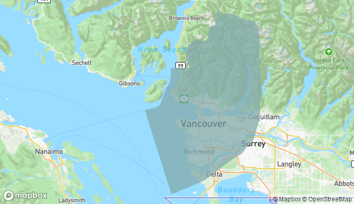

# Acknowledgements
This Knowledge Base was authored by Lily Demet. 

## Site Template
Site template adapted from the [just-the-docs](https://github.com/pmarsceill/just-the-docs) Jekyll template created by [Patrick Marsceil](https://github.com/pmarsceill) and available under the [MIT License](http://opensource.org/licenses/MIT).

## Land acknowledgement

Before beginning the workshop, we'd like to acknowledge the indigenous lands where we are located. The UBC Vancouver campus is located on the traditional, ancestral, and unceded territory of the xʷməθkʷəy̓əm (Musqueam) peoples.

 
*Map of Musqueam territory from [Native Land Digital](https://native-land.ca/maps/territories/x%CA%B7m%C9%99%CE%B8k%CA%B7%C9%99y%C9%99m/)*

Please take a moment to explore [native-land.ca](https://native-land.ca/) so that you can visualize the indigenous territories, languages, and treaties in your area.