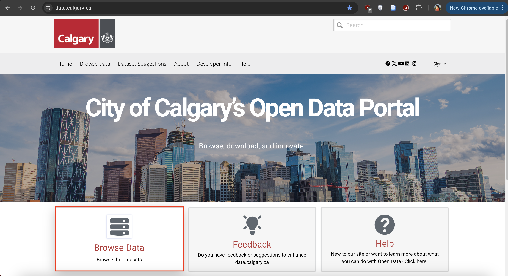
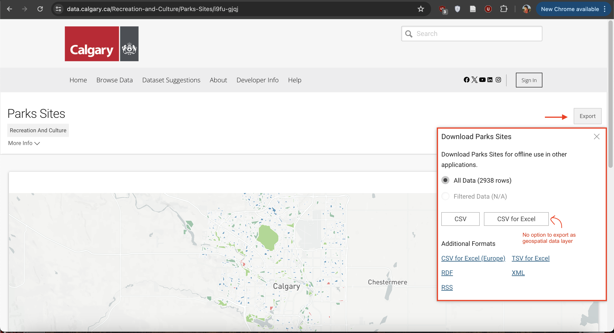
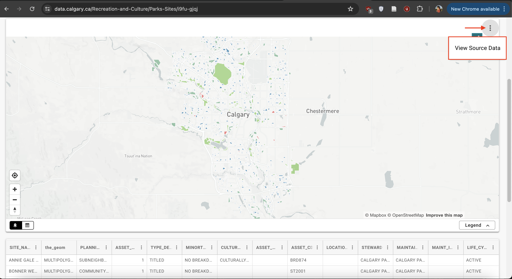
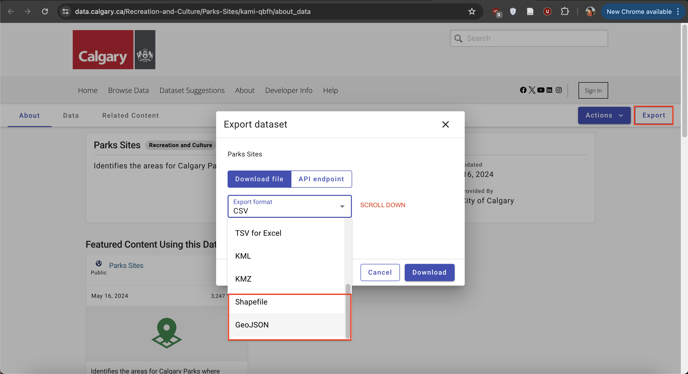

# Finding Data Exercise

## When there's a map, there's geospatial data
Downloading geospatial data from municipal data portals isn't always straightforward.It can be tricky to find the right buttons to press to downlaod the right file format. 

    

    

To do:
Practice finding data by downloading a geospatial dataset  of parks from one (or more) of the following municipal open data portals. Geojson (possible for all), WGS84 if option. Polygon. Might not be named simply 'parks' but parks and open spaces etc. 

 

[Victoria](https://opendata.victoria.ca/)  
[Guelph](http://data.open.guelph.ca/) Note - when you go to resource - raw geojson. copy contents. go to [geojson dot io](https://geojson.io/#map=2/0/20). delete contents on left hand column. paste your data in. save.  
[Vancouver](https://opendata.vancouver.ca/pages/home/) 
[Toronto](https://open.toronto.ca/) 
[Kelowna](https://opendata.kelowna.ca/) 
[Kamloops](https://mydata-kamloops.opendata.arcgis.com/) 
[Calgary](https://data.calgary.ca/)  

- dowload restaurants? [restaurants](https://opendata.vancouver.ca/explore/dataset/business-licences/export/?disjunctive.status&disjunctive.businesssubtype&sort=businesstype&refine.businesstype=Restaurant&refine.status=Issued&location=12,49.24813,-123.12161&dataChart=eyJxdWVyaWVzIjpbeyJjaGFydHMiOlt7InR5cGUiOiJsaW5lIiwiZnVuYyI6IkNPVU5UIiwieUF4aXMiOiJmZWVwYWlkIiwic2NpZW50aWZpY0Rpc3BsYXkiOnRydWUsImNvbG9yIjoiIzAyNzlCMSJ9XSwieEF4aXMiOiJmb2xkZXJ5ZWFyIiwibWF4cG9pbnRzIjoiIiwidGltZXNjYWxlIjoiIiwic29ydCI6IiIsImNvbmZpZyI6eyJkYXRhc2V0IjoiYnVzaW5lc3MtbGljZW5jZXMiLCJvcHRpb25zIjp7ImRpc2p1bmN0aXZlLnN0YXR1cyI6dHJ1ZSwiZGlzanVuY3RpdmUuYnVzaW5lc3NzdWJ0eXBlIjp0cnVlLCJzb3J0IjoiYnVzaW5lc3N0eXBlIiwicmVmaW5lLmJ1c2luZXNzdHlwZSI6IlJlc3RhdXJhbnQiLCJyZWZpbmUuc3RhdHVzIjoiSXNzdWVkIn19fV0sImRpc3BsYXlMZWdlbmQiOnRydWUsImFsaWduTW9udGgiOnRydWUsInRpbWVzY2FsZSI6IiJ9)

Whether you're performing spatial analysis or making maps for yourself or a client, its important to keep a record of your data sources as you work. You'll figure out a system that make sense to you. Trial and error a few times. However, The following considerations are useful to note somewhere like a document or notes file as you go. 

- What is the dataset of and where did you download it from (save a link)
- What is the downloaded file called? Where is it stored on your computer/external storage device?
- Is there a visual data preview such as an interactive web map?
- What attributes are included in the dataset? 
- Who is the dataset published by and is there a contact for questions? 
- What is the dataset's license?
- When was it last updated?
- What formats can the dataset be downloaded in? 
- What projections can the dataset be downloaded in?

> ask - what was most challenging step
> geojson.io 