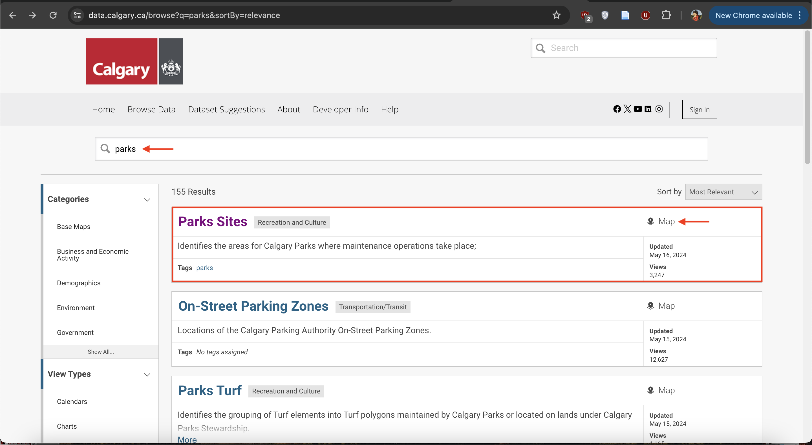

# Practice Finding Data

## When there's a map, there's geospatial data
Downloading geospatial data from municipal data portals isn't always straightforward.It can be tricky to find the right buttons to press to downlaod the right file format. 

    

    

---

## To do #1
Practice finding data by downloading a geospatial dataset  of parks from one (or more) of the following municipal open data portals. Geojson (possible for all), WGS84 if option. Polygon. Might not be named simply 'parks' but parks and open spaces etc. 

 

[Victoria](https://opendata.victoria.ca/)  
[Guelph](http://data.open.guelph.ca/) Note - when you go to resource - raw geojson. copy contents. go to [geojson dot io](https://geojson.io/#map=2/0/20). delete contents on left hand column. paste your data in. save.  
[Vancouver](https://opendata.vancouver.ca/pages/home/) 
[Toronto](https://open.toronto.ca/) 
[Kelowna](https://opendata.kelowna.ca/) 
[Kamloops](https://mydata-kamloops.opendata.arcgis.com/) 
[Calgary](https://data.calgary.ca/)  

## To do #2

Use the Filter function to download only Restaurants with Issued licenses from all [business licenses](https://opendata.vancouver.ca/explore/dataset/business-licences/export/?disjunctive.status&disjunctive.businesssubtype&sort=businesstype&dataChart=eyJxdWVyaWVzIjpbeyJjaGFydHMiOlt7InR5cGUiOiJsaW5lIiwiZnVuYyI6IkNPVU5UIiwieUF4aXMiOiJmZWVwYWlkIiwic2NpZW50aWZpY0Rpc3BsYXkiOnRydWUsImNvbG9yIjoiIzAyNzlCMSJ9XSwieEF4aXMiOiJmb2xkZXJ5ZWFyIiwibWF4cG9pbnRzIjoiIiwidGltZXNjYWxlIjoiIiwic29ydCI6IiIsImNvbmZpZyI6eyJkYXRhc2V0IjoiYnVzaW5lc3MtbGljZW5jZXMiLCJvcHRpb25zIjp7ImRpc2p1bmN0aXZlLnN0YXR1cyI6dHJ1ZSwiZGlzanVuY3RpdmUuYnVzaW5lc3NzdWJ0eXBlIjp0cnVlLCJzb3J0IjoiYnVzaW5lc3N0eXBlIiwicmVmaW5lLmJ1c2luZXNzdHlwZSI6IlJlc3RhdXJhbnQiLCJyZWZpbmUuc3RhdHVzIjoiSXNzdWVkIn19fV0sImRpc3BsYXlMZWdlbmQiOnRydWUsImFsaWduTW9udGgiOnRydWUsInRpbWVzY2FsZSI6IiJ9&location=12,49.24813,-123.12161)

## To do #3 
Use the interactive map to download the aerial imagery for one grid tile. Click the tile and download the zip folder under the field
[MRSID_URL](https://opendata.vancouver.ca/explore/dataset/orthophoto-imagery-2015/map/?location=13,49.25991,-123.19064). 

