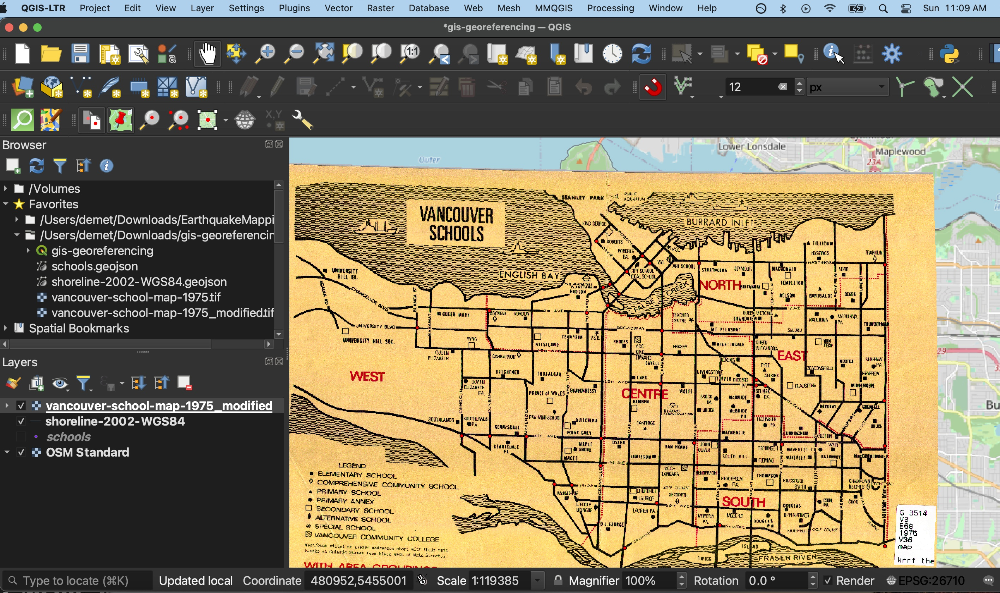

# Georeferencing
Georeferencing appends coordinate information to non-spatial data, such as images. While historical maps represent a place, tracing geographic features such as roads, rivers, buildings, cities, and political boundaries, they cannot be read by a Geographic Information System (GIS) because the locational data for these features is not stored in a manner legible to the GIS––i.e., in latitude/longitude coordinate pairs. Georeferencing is the process of warping an image so that its geographic features match the location of those on a known geospatial layer.

Note that georeferencing is not geocoding. Geocoding is when you have a tabular dataset with street addresses and you use a GIS to geolocate the data as coordinate points.

**Check out the Research Commons' <a href="https://ubc-library-rc.github.io/gis-georeferencing/" target="_blank">Georeferencing Historical Maps</a> workshop for more.**

 
