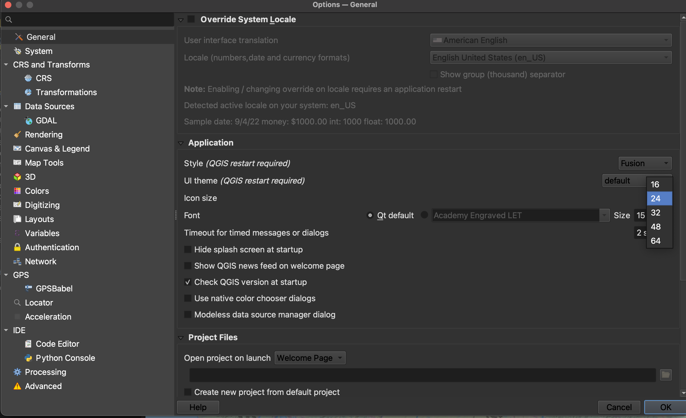

# Project Setup

## Open a new QGIS project
After downloading and installing QGIS-LTR, launch  QGIS application from your computer. Double click "New Empty Project" to open a new project. 

Save the project to a location and give it a name. It's best practice to save your QGIS projects to the folder where you keep your data for the project. The file extension will be `.qgz`. To save your project, navigate to the **Project** Menu at the stop of your screen and go down to "Save As". 

---

## QGIS Graphical User Interface (GUI)

See [QGIS GUI](https://docs.qgis.org/3.34/en/docs/user_manual/introduction/qgis_gui.html#qgis-gui) for an elaboration on each element of the user interface.

>**Toolbars** - Toolbars are where you will find the most useful geoprocessing, editing, navigation, and other tools. You can customize this area of your GUI to fit your needs. 
   
>**Browser and Layers Panel** - The browser panel lets you easily navigate your file system for data and project files. Your layers panel displays your project's data layers and provides access to configuration settings. Show and Hide Panels by going to the "View" Menu at the top of your screen and going down to the Panels or Toolbars submenu. Alternatively, you can right-click (control-click) any of the blank space on the Toolbar to see what Tools and Panels are currently active. 
    
> **Status Bar** - The status bar displays current information about the map canvas, and allows you to make adjustments in the map's scale and rotation. 

    
> **Map Canvas or Map View** - Call it either one. This is where the map is displayed as layers are loaded. You can zoom/pan the map canvas as well as select features and other operations.

---
## Project Properties
The [Project Properties](https://docs.qgis.org/3.34/en/docs/user_manual/introduction/qgis_configuration.html#project-properties) provide useful information about your QGIS project, such as it's Coordinate Reference System (CRS). Although the different data layers you add to a QGIS project may have different projections, QGIS will reproject everything 'on the fly' to match the Project CRS. Setting the project CRS doesn’t change the stored projection of each layer, only how they are rendered by QGIS. Read the [QGIS Documentation on coordinate reference systems](https://docs.qgis.org/3.28/en/docs/gentle_gis_introduction/coordinate_reference_systems.html) or check out the Library's [workshop on projections](https://ubc-library-rc.github.io/map-projections/content/CRS.html) if you're interested in learning more. Another great reasource is [pbcgis.com/projection_fundamentals/](https://www.pbcgis.com/projection_fundamentals/). 

Under **General** properties, make note of the units for area measurement. 

 

---
## Interface Preferences 
You can change the look and feel of your GUI, as well as adjust default settings from **QGIS-LTR --> Preferences** or **Settings --> Options.** 

### Increasing Icon and Font Size
To increase the size of icons and text on your interface, go to the **Settings** menu at the top of your screen and click on **Options**.
   

Resize the dialogue box so you can see the drop-down for "icon size" and "font." Icon changes will happen as soon as you click OK. Changes in font size won't update until you quit and restart QGIS, so make sure you save your project now. 
   

---
#### Resources for Project Setup
- [QGIS GUI comprehensive documentation](https://docs.qgis.org/3.34/en/docs/user_manual/introduction/qgis_gui.html#qgis-gui)
- [QGIS Configuration](https://docs.qgis.org/3.34/en/docs/user_manual/introduction/qgis_configuration.html#)
- [QGIS Project Properties](https://docs.qgis.org/3.34/en/docs/user_manual/introduction/qgis_configuration.html#project-properties)