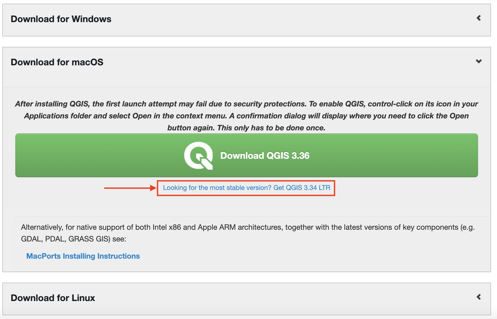

# What is QGIS?
*Introduction to what qgis is and resources to learn more about qgis*
    

QGIS is a popular desktop GIS software, and considered a **f**ree and **o**pen **s**ource **s**oftware **(FOSS)** with a very active development community. 

### QGIS UPS⇡DE
- Runs on Windows, Mac, Linux, Android
- Extensive [online documentation](https://docs.qgis.org/3.28/en/docs/training_manual/index.html)
- Active development and user communities
- Robust plugin repository for extended functionality

### QGIS DOWNS⇣DE
- Most recent features can be buggy
- Plugins lack standardized documentation
- Troubleshooting = Googling 

## Downloading and Installing QGIS
QGIS can be downloaded from [qgis.org's Downloads page](https://qgis.org/en/site/forusers/download.html). In most cases, you'll want to download and install the **Long term release** (LTR) instead of the latest release. This is just below the big green button. Downloading the QGIS-LTR will give you most of the functionality you'll need, without encountering the software bugs of newly released versions.

---
#### Resources to learn QGIS 
- [Map Production with QGIS](https://ubc-library-rc.github.io/gis-intro-qgis/)
- [QGIS User Guide](https://docs.qgis.org/3.34/en/docs/user_manual/index.html) 
- [QGIS Trainig Material](https://docs.qgis.org/3.34/en/docs/training_manual/index.html)
- [Spatial Thoughts Academy QGIS course](https://courses.spatialthoughts.com/introduction-to-qgis.html)
- Googling your questions. It's likely you're not the first one to run into an issue. Use specific jargon as search terms. Browse youtube videos. Scroll through stack exchange conversations. 

