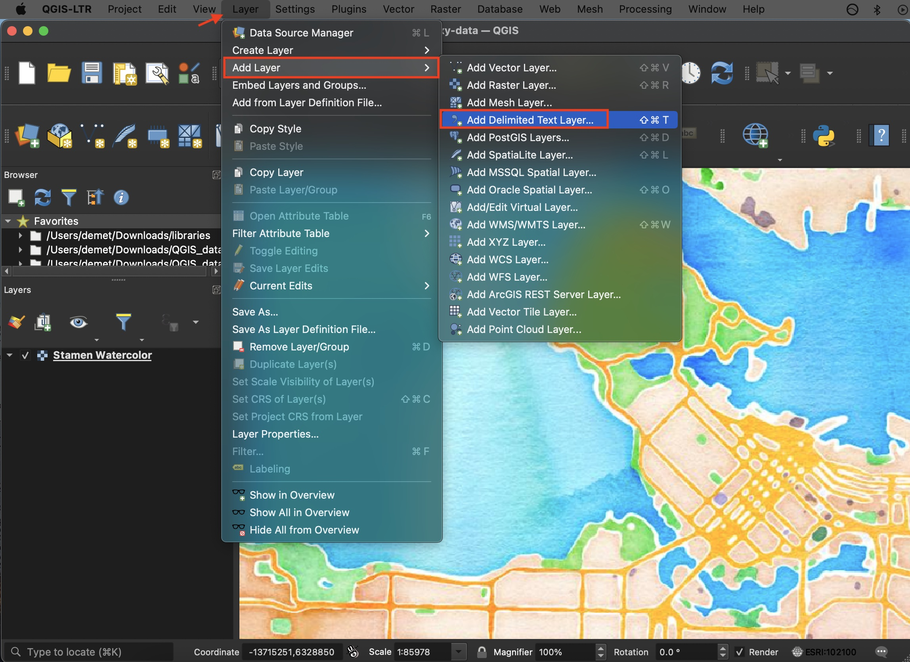
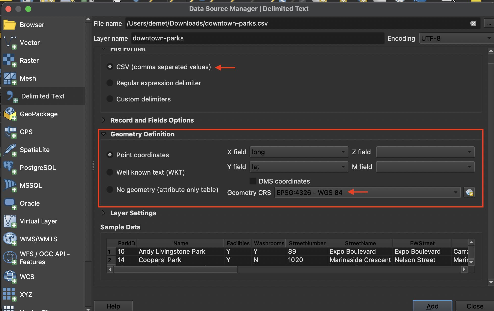
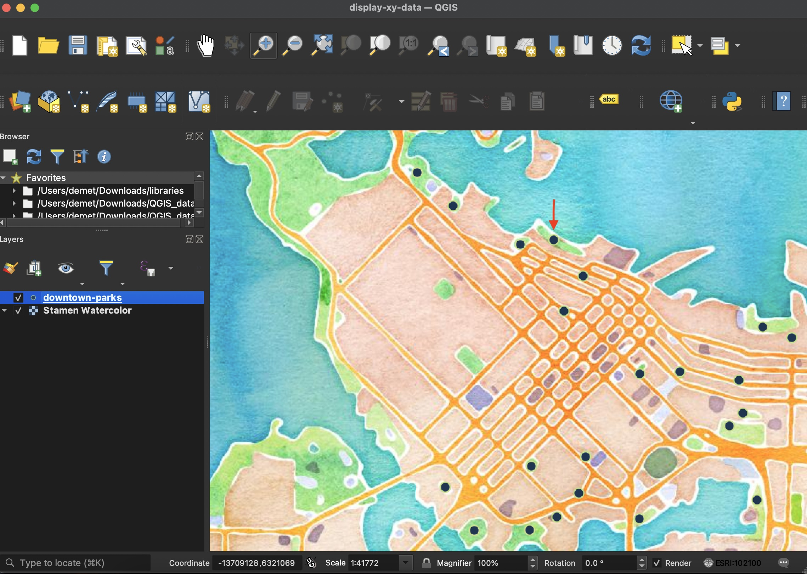

# Displaying Tabular data 

Do you have a spreadsheet with coordinate pairs? This workflow describes how to georeference tabular data in QGIS given your dataset has latitude and longitude information in decimal degrees for each point (aka row, record, or instance). For demonstration purposes, this tutorial uses a a dataset of parks in downtown vancouver, downloaded from the city's [open data portal](https://opendata.vancouver.ca/explore/dataset/parks).

### Before you begin...
First, make sure latitude and longitude are in separate columns. Second, try to find out the geographic coordinate system (GCS) of your dataset. Check the page you downloaded your data from or contact the dataset owner. Knowing this will ensure your data is projected accurately when added. Finally, if you're not working with any other shapefiles, you can open a blank QGIS project now and [add a basemap from the web](https://github.com/ubc-lib-geo/qgis-add-basemap). 

## Add your data layer to QGIS 
Save your dataset as a csv file. Open a QGIS project and navigate to add **Delimited Text Layer**. 
  
In the dialogue box that opens, navigate to your saved csv file and select it Under **Geometry Definition** select 'Point coordinates.' Your **X** field should be **longitude** and your **Y**, **latitude**. If you find this to be counterintuitive, think about which variable changes as you move along the Y axis of a projection (north-to-south); along the X axis of a projection (east-to-west). Last, set the **Geometry CRS** (coordinate reference system) to the GCS your dataset lat and long are stored in. Click **Add** and your point dataset should now be projected 
  

QGIS will automatically project your layer in the coordinate reference system of your project. (Depending on your application settings your project will be assigned either a default CRS or take on the CRS of the first layer you add). By doing this, QGIS is not changing the GCS you just assigned, but rather adjusting *where* the points are rendered so that they remain accurate in location given any projection. 
