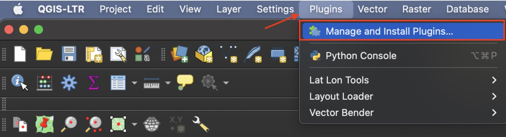
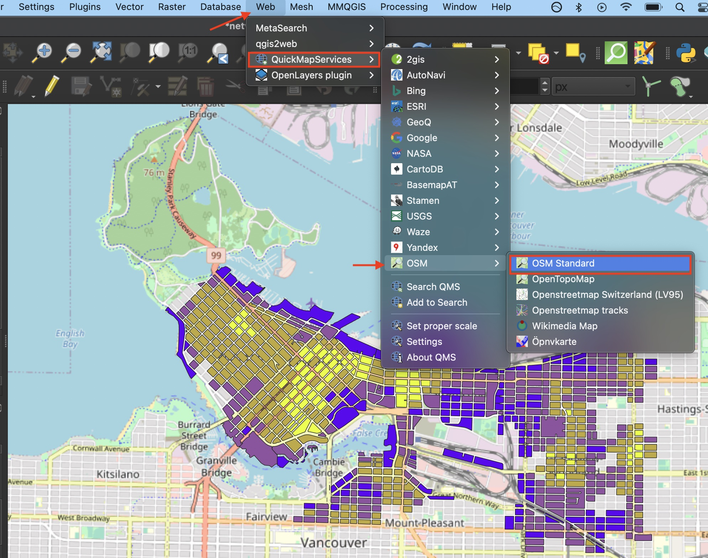

# Adding A Basemap      

## Add basemap from web plugin
One way to add a basemap is through a plugin. This will connect access to a host of different basemaps you can search directly from the QGIS interface. [QGIS plugins](https://plugins.qgis.org/) are user developed tools that extend QGIS functionality beyond the basics. To access basemaps, we'll first install the QuickMapServices plugin. Click on the **Plugin** menu at the top of your screen and select **Manage and Install Plugins...**   

 
   
In the dialogue box that opens, select **All** as a search category on the left and type "QuickMapServices" as one word. Install the plugin and close the dialogue box.    

  
Now go to the **Web** menu at the top of your screen. You should see the QuickMapServices plugin. Hover over it and click "Settings" at the bottom of the menu that pops up. In the settings dialogue box go to the "More services" tab and click "Get contributed pack." Click **save** to close settings and return to the **Web** menu. This time when you hover over the QuickMapServices plugin you will see an array of basemap options. Select OpenStreetMap as your basemap. Make sure to drag your basemap to the bottom in your Layers Panel. Remove the basemap at anytime by right clicking the layer and selecting "remove." Like QGIS, [Open Street Map (OSM)](https://www.openstreetmap.org/about) is open source and user developed. If you find web-based maps interesting, check out the Research Commons' [Leaflet Workshop!](https://ubc-library-rc.github.io/gis-intro-leaflet/) 

 

## Add a basemap as a tile layer
To add a tile layer from a web server:
- Open the File Browser and add a new **XYZ Tiles** connection 
  * Name: ESRI Satellite
  * URL: `https://server.arcgisonline.com/ArcGIS/rest/services/World_Imagery/MapServer/tile/{z}/{y}/{x}`
- Click **OK** and return to the browser dialogue. Select your new ESRI Satellite tile connection from the drop down menu and click **Add** at the bottom
- Return to your map canvas. You should now see a basemap. Drag the ESRI Satellite layer underneath your data layers 

